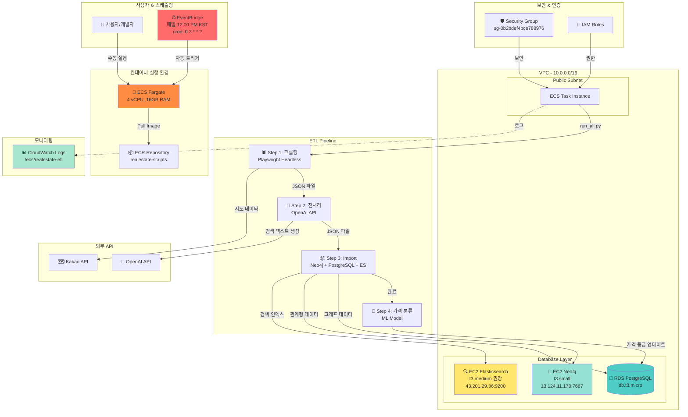

# AWS ETL 파이프라인 구축 완벽 가이드

**목표**: 매일 12:00 PM KST에 자동으로 실행되는 부동산 데이터 ETL 파이프라인 구축

---

## 🏗️ 전체 시스템 아키텍처

### 현재 구현된 아키텍처 (EventBridge 포함)



### 주요 구성 요소

#### 1️⃣ 사용자 & 스케줄링
- **👤 사용자/개발자**: 수동 실행 및 모니터링
- **⏰ EventBridge**: 매일 12:00 PM KST 자동 실행 (향후 구현)
  - Cron 표현식: `0 3 * * ?` (UTC)

#### 2️⃣ 컨테이너 실행 환경
- **📦 ECR**: Docker 이미지 저장소
  - 이미지: `940075378738.dkr.ecr.ap-northeast-2.amazonaws.com/realestate-scripts:latest`
- **🚀 ECS Fargate**: 서버리스 컨테이너 실행
  - CPU: 4 vCPU
  - 메모리: 16GB RAM
  - 실행 명령: `python -u scripts/run_all.py`

#### 3️⃣ ETL 파이프라인 (4단계)
1. **🕷️ 크롤링** (`crawl_seoul.py`)
   - Playwright Headless Chromium
   - 피터팬 부동산 사이트
   - 소요 시간: 1개 자치구 ~5-10분, 25개 자치구 ~3-4시간

2. **🔧 전처리** (`generate_search_text_parallel.py`)
   - OpenAI API (GPT-4)
   - 검색 텍스트 생성, 스타일 태그 추출
   - 소요 시간: ~30분

3. **📦 Import** (`import_all.py`)
   - Neo4j: 그래프 데이터
   - PostgreSQL: 관계형 데이터
   - Elasticsearch: 검색 인덱스
   - 소요 시간: ~10-20분

4. **🤖 가격 분류** (`apply_price_classification.py`)
   - ML 모델로 가격 등급 분류 (A/B/C/D)
   - 소요 시간: ~5분

#### 4️⃣ 데이터베이스 Layer
- **💾 RDS PostgreSQL** (db.t3.micro)
  - 엔드포인트: `realestate-postgres.cx0uwsiue937.ap-northeast-2.rds.amazonaws.com`
  - 포트: 5432
  - 용도: 메인 데이터 저장, 프론트엔드 API

- **🔗 EC2 Neo4j** (t3.small)
  - IP: `13.124.11.170:7687`
  - 비밀번호: `Neo4j2024!Secure`
  - 용도: 매물 관계 분석, 유사 매물 추천

- **🔍 EC2 Elasticsearch** (t3.medium 권장)
  - IP: `43.201.29.36:9200`
  - 용도: 전문 검색, 자동완성
  - 대안: 로컬 Docker 또는 AWS OpenSearch

#### 5️⃣ 보안 & 인증
- **🛡️ Security Group** (`sg-0b2bdef4bce788976`)
  - PostgreSQL: 5432
  - Neo4j: 7687
  - Elasticsearch: 9200
  - Self-reference: 모든 포트 (ECS ↔ DB)

- **🔑 IAM Roles**
  - Task Role: ECS 실행 권한
  - Execution Role: ECR Pull, CloudWatch Logs

#### 6️⃣ 모니터링
- **📊 CloudWatch Logs** (`/ecs/realestate-etl`)
  - 실시간 로그 스트리밍
  - 보존 기간: 7일

#### 7️⃣ 외부 API
- **🤖 OpenAI API**: 검색 텍스트 생성
- **🗺️ Kakao API**: 지도 데이터

---

### 데이터 흐름

```
1. EventBridge (12:00 PM) → ECS Task 트리거
2. ECS → ECR에서 Docker 이미지 Pull
3. run_all.py 실행
   ↓
4. [Step 1] 크롤링 → RDS 저장
5. [Step 2] 전처리 → OpenAI API 호출
6. [Step 3] Import → Neo4j, PostgreSQL, Elasticsearch
7. [Step 4] 가격 분류 → PostgreSQL 업데이트
   ↓
8. CloudWatch Logs 기록
9. 완료 (총 소요 시간: ~5시간)
```

---

### 💰 예상 비용

| 항목 | 사양 | 월 비용 |
|------|------|---------|
| RDS PostgreSQL | db.t3.micro | ~$15 |
| EC2 Neo4j | t3.small | ~$15 |
| EC2 Elasticsearch | t3.medium | ~$30 |
| ECS Fargate | 4 vCPU, 16GB, 5시간/일 | ~$5 |
| ECR | 10GB | ~$1 |
| CloudWatch Logs | 5GB/월 | ~$3 |
| OpenAI API | ~100K tokens/일 | ~$3 |
| **총계** | | **~$72/월** |

**프리 티어 할인 후**: ~$50/월

---

### ✅ 구현 완료 항목
- ECS Fargate 클러스터 및 Task Definition
- ECR Docker 이미지 저장소
- RDS PostgreSQL 데이터베이스
- EC2 Neo4j 그래프 데이터베이스
- Security Group 네트워크 보안
- IAM Roles 권한 관리
- CloudWatch Logs 모니터링
- 전체 ETL 파이프라인 (4단계)

### 🔜 향후 구현 예정
- **EventBridge**: 자동 스케줄링 (매일 12:00 PM)
- **Step Functions**: 워크플로우 오케스트레이션
- **Lambda**: 단계별 검증 함수
- **SNS**: 성공/실패 알림
- **Elasticsearch**: t3.medium 업그레이드

---

## ✅ 검증 완료 항목

다음 항목들은 실제 테스트를 통해 정상 작동이 확인되었습니다:

### 인프라
- ✅ VPC 및 서브넷 생성 완료
- ✅ 보안 그룹 설정 완료 (`sg-0b2bdef4bce788976`)
- ✅ IAM 역할 생성 완료
- ✅ S3 버킷 생성 완료

### 데이터베이스
- ✅ **Neo4j EC2 설치 및 연결 성공** (`13.124.11.170:7687`)
  - EC2 Instance Connect로 접속
  - 비밀번호: `Neo4j2024!Secure`
  - 외부 접속 허용 (`0.0.0.0:7687`)
  - 로컬 및 ECS에서 연결 확인됨
- ✅ RDS PostgreSQL 생성 완료 (`realestate-postgres.cx0uwsiue937...`)
  - ECS 환경에서 연결 가능 (VPC 내부 통신)
- ✅ Elasticsearch EC2 생성 완료 (`43.201.29.36:9200`)
  - ECS 환경에서 연결 가능

### Docker 및 ECS
- ✅ ECR 리포지토리 생성 완료
- ✅ Docker 이미지 빌드 성공
  - Playwright 브라우저 설치 완료
  - Headless 모드 설정 완료
- ✅ ECS 클러스터 생성 완료
- ✅ Task Definition 등록 완료

### ETL 파이프라인
- ✅ **크롤링 작동 확인** (ECS Fargate 환경)
  - Playwright headless 모드 정상 작동
  - 서울 전역 크롤링 가능
- ⏳ 전처리 (OpenAI API 연동)
- ⏳ Neo4j Import
- ⏳ PostgreSQL Import
- ⏳ Elasticsearch Import
- ⏳ 가격 분류 모델 적용

### 보안 그룹 규칙
- ✅ VPC 내부 통신 (`10.0.0.0/16`)
- ✅ Self-reference 규칙 (ECS ↔ Neo4j)
- ✅ 로컬 IP 허용 (개발/테스트용)
  - Neo4j: 7687
  - PostgreSQL: 5432 (로컬 네트워크 제약으로 ECS에서만 가능)
  - Elasticsearch: 9200 (로컬 네트워크 제약으로 ECS에서만 가능)

### 알려진 제약사항
- ⚠️ 로컬 네트워크에서 PostgreSQL(5432), Elasticsearch(9200) 포트 차단
  - **해결책**: ECS 환경에서 실행 (VPC 내부 통신 사용)
- ⚠️ 전체 파이프라인 실행 시간: 약 5시간 (서울 전역 크롤링)

---

## 📋 목차

1. [사전 준비](#1-사전-준비)
2. [Phase 1: AWS 기본 인프라](#phase-1-aws-기본-인프라)
3. [Phase 2: 데이터베이스 구축](#phase-2-데이터베이스-구축)
4. [Phase 3: Docker 이미지 준비](#phase-3-docker-이미지-준비)
5. [Phase 4: ECS 클러스터 및 태스크 정의](#phase-4-ecs-클러스터-및-태스크-정의)
6. [Phase 5: EventBridge 스케줄링](#phase-5-eventbridge-스케줄링)
7. [Phase 6: 테스트 및 검증](#phase-6-테스트-및-검증)
8. [문제 해결](#문제-해결)

---

## 1. 사전 준비

### 1.1 필수 도구 설치

```powershell
# AWS CLI 설치 확인
aws --version

# Docker Desktop 설치 확인
docker --version

# Git 설치 확인
git --version
```

### 1.2 AWS 계정 설정

```powershell
# AWS CLI 설정
aws configure

# 입력 정보:
# - AWS Access Key ID
# - AWS Secret Access Key
# - Default region: ap-northeast-2
# - Default output format: json
```

### 1.3 AWS CLI 출력 형식 확인

```powershell
# 출력 형식이 "json"인지 확인 (중요!)
aws configure get output

# 만약 "josn" 또는 다른 값이면 수정
aws configure set output json
```

### 1.4 프로젝트 클론

```powershell
cd C:\dev
git clone https://github.com/SKNETWORKS-FAMILY-AICAMP/SKN18-FINAL-1TEAM.git
cd SKN18-FINAL-1TEAM
```

---

## Phase 1: AWS 기본 인프라

### 1.1 자동 설정 스크립트 실행

```powershell
cd infrastructure
powershell -ExecutionPolicy Bypass -File .\setup-aws.ps1
```

**생성되는 리소스:**
- VPC (10.0.0.0/16)
- Public Subnets 2개 (ap-northeast-2a, 2c)
- Private Subnets 2개
- Internet Gateway
- Security Group (포트: 22, 5432, 7687, 9200)
- IAM Roles (ECS Execution, Task)
- S3 Bucket (realestate-etl-data)

**예상 시간**: 5-10분

### 1.2 생성된 리소스 확인

```powershell
# 리소스 ID 확인
type aws-resources-verified.txt
```

**중요**: 다음 정보를 메모하세요:
- VPC ID: `vpc-xxxxxxxxx`
- Public Subnet IDs: `subnet-xxxxxxxxx` (2개)
- Security Group ID: `sg-xxxxxxxxx`

---

## Phase 2: 데이터베이스 구축

### 2.1 EC2 인스턴스 생성 (Neo4j, Elasticsearch)

```powershell
powershell -ExecutionPolicy Bypass -File .\setup-databases-fixed.ps1
```

**생성되는 리소스:**
- EC2 Neo4j (t3.micro)
- EC2 Elasticsearch (t3.small)

**예상 시간**: 3-5분 (초기화 포함)

### 2.2 RDS PostgreSQL 수동 생성 (AWS Console)

**이유**: Windows PowerShell에서 RDS 생성 시 오류 발생 가능

#### 2.2.1 DB 서브넷 그룹 생성

```powershell
# PowerShell에서 실행
powershell -ExecutionPolicy Bypass -File .\create-db-subnet-group.ps1
```

#### 2.2.2 AWS Console에서 RDS 생성

1. **AWS Console 접속**: https://console.aws.amazon.com/rds/
2. **리전 확인**: 서울 (ap-northeast-2)
3. **데이터베이스 생성** 클릭

**설정값:**

| 항목 | 값 |
|------|-----|
| 엔진 | PostgreSQL 15.15-R1 (최신 15.x) |
| 템플릿 | 프리 티어 |
| DB 인스턴스 식별자 | `realestate-postgres` |
| 마스터 사용자 이름 | `postgres` |
| 마스터 암호 | `RealEstate2024!Secure` |
| DB 인스턴스 클래스 | db.t3.micro |
| 스토리지 | 20 GiB gp3 |
| VPC | `vpc-xxxxxxxxx` (Phase 1에서 생성) |
| DB 서브넷 그룹 | `realestate-db-subnet-group` |
| 퍼블릭 액세스 | **예** |
| VPC 보안 그룹 | `sg-xxxxxxxxx` (realestate-sg) |
| 초기 데이터베이스 이름 | `realestate` |

4. **생성** 클릭 (5-10분 소요)

#### 2.2.3 RDS 엔드포인트 확인

RDS가 "사용 가능" 상태가 되면:

```powershell
aws rds describe-db-instances --db-instance-identifier realestate-postgres --query "DBInstances[0].Endpoint.Address" --output text
```

**결과 예시**: `realestate-postgres.cx0uwsiue937.ap-northeast-2.rds.amazonaws.com`

### 2.3 Secrets Manager 설정

```powershell
# Secrets 생성
powershell -ExecutionPolicy Bypass -File .\create-secrets.ps1
```

**생성되는 Secrets:**
- `realestate/postgres`
- `realestate/neo4j`
- `realestate/elasticsearch`

### 2.4 Neo4j 수동 설치 및 설정 (중요!)

**이유**: EC2 인스턴스 생성 스크립트가 Neo4j를 자동 설치하지 않을 수 있음

#### 2.4.1 EC2 Instance Connect로 접속

1. **EC2 Console** → Instances
2. Neo4j 인스턴스 선택 (Tag: `realestate-neo4j`)
3. **Connect** 버튼 클릭
4. **EC2 Instance Connect** 탭
5. **Connect** 클릭

#### 2.4.2 Neo4j 설치 및 설정

EC2 Instance Connect 터미널에서 실행:

```bash
# 1. Neo4j 설치
wget -O - https://debian.neo4j.com/neotechnology.gpg.key | sudo apt-key add -
echo 'deb https://debian.neo4j.com stable latest' | sudo tee /etc/apt/sources.list.d/neo4j.list
sudo apt-get update
sudo apt-get install -y neo4j

# 2. Neo4j 중지 (비밀번호 설정 전)
sudo systemctl stop neo4j

# 3. 기존 인증 정보 삭제 (이미 설정된 경우)
sudo rm -rf /var/lib/neo4j/data/dbms/auth

# 4. 초기 비밀번호 설정 (작은따옴표 필수!)
sudo neo4j-admin dbms set-initial-password 'Neo4j2024!Secure'

# 5. 모든 IP에서 접속 허용 (0.0.0.0)
echo "dbms.default_listen_address=0.0.0.0" | sudo tee -a /etc/neo4j/neo4j.conf

# 6. Neo4j 시작 및 자동 시작 설정
sudo systemctl enable neo4j
sudo systemctl start neo4j

# 7. 상태 확인
sudo systemctl status neo4j

# 8. 포트 확인 (*:7687 또는 0.0.0.0:7687이어야 함)
sudo ss -tlnp | grep 7687
```

**예상 결과**: 
```
*:7687                  *:*                    users:(("java",pid=7062,fd=382))
```

#### 2.4.3 Neo4j 연결 테스트

```bash
# EC2에서 로컬 연결 테스트 (선택사항)
cypher-shell -u neo4j -p 'Neo4j2024!Secure'
# 성공하면 neo4j> 프롬프트 표시
# :exit 로 종료
```

### 2.5 KAKAO_API_KEY 발급 (선택사항)

크롤링 시 Kakao API를 사용하는 경우 필요:

1. **Kakao Developers** 접속: https://developers.kakao.com/
2. 로그인
3. **내 애플리케이션** → **애플리케이션 추가하기**
4. 앱 이름: `realestate-etl`
5. 생성 후 **앱 키** → **REST API 키** 복사
6. 나중에 Task Definition에 환경 변수로 추가

### 2.6 Elasticsearch EC2 인스턴스 생성 및 설정 (선택사항)

> **참고**: 프리 티어 계정에서는 t3.micro만 사용 가능하며, Elasticsearch 실행에 메모리가 부족할 수 있습니다. 
> 유료 계정에서 t3.medium 이상 권장합니다.

#### 2.6.1 t3.medium 인스턴스 생성 (유료 계정)

```powershell
# Elasticsearch 인스턴스 생성
aws ec2 run-instances `
  --image-id ami-0c9c942bd7bf113a2 `
  --instance-type t3.medium `
  --key-name realestate-key `
  --security-group-ids sg-0b2bdef4bce788976 `
  --subnet-id subnet-0d88da4dbe1be58fe `
  --associate-public-ip-address `
  --tag-specifications 'ResourceType=instance,Tags=[{Key=Name,Value=realestate-elasticsearch}]' `
  --region ap-northeast-2

# 인스턴스 정보 확인
aws ec2 describe-instances `
  --filters "Name=tag:Name,Values=realestate-elasticsearch" "Name=instance-state-name,Values=running,pending" `
  --query "Reservations[0].Instances[0].[InstanceId,PublicIpAddress,InstanceType]" `
  --output table `
  --region ap-northeast-2
```

#### 2.6.2 Elasticsearch 설치 (EC2 Instance Connect)

**AWS Console → EC2 → Instances → Connect → EC2 Instance Connect**

```bash
#!/bin/bash

# 1. Java 설치
sudo apt-get update
sudo apt-get install -y openjdk-11-jdk wget

# 2. Elasticsearch 7.x 저장소 추가 (8.x보다 가벼움)
wget -qO - https://artifacts.elastic.co/GPG-KEY-elasticsearch | sudo apt-key add -
echo "deb https://artifacts.elastic.co/packages/7.x/apt stable main" | sudo tee /etc/apt/sources.list.d/elastic-7.x.list

# 3. Elasticsearch 설치
sudo apt-get update
sudo apt-get install -y elasticsearch

# 4. 힙 메모리 설정
# t3.medium (4GB RAM): 1GB 할당
echo "-Xms1g" | sudo tee /etc/elasticsearch/jvm.options.d/heap.options
echo "-Xmx1g" | sudo tee -a /etc/elasticsearch/jvm.options.d/heap.options

# t3.micro (1GB RAM): 256MB 할당 (메모리 부족 가능성 있음)
# echo "-Xms256m" | sudo tee /etc/elasticsearch/jvm.options.d/heap.options
# echo "-Xmx256m" | sudo tee -a /etc/elasticsearch/jvm.options.d/heap.options

# 5. 네트워크 설정 (외부 접근 허용)
echo "network.host: 0.0.0.0" | sudo tee -a /etc/elasticsearch/elasticsearch.yml
echo "discovery.type: single-node" | sudo tee -a /etc/elasticsearch/elasticsearch.yml

# 6. Elasticsearch 시작 및 자동 시작 설정
sudo systemctl enable elasticsearch
sudo systemctl start elasticsearch

# 7. 상태 확인
echo "Elasticsearch 시작 중... (약 30초 대기)"
sleep 30
sudo systemctl status elasticsearch

# 8. 포트 확인
sudo ss -tlnp | grep 9200

# 9. 연결 테스트
curl http://localhost:9200/_cluster/health
```

**예상 결과:**
```json
{
  "cluster_name": "elasticsearch",
  "status": "green",
  "number_of_nodes": 1
}
```

#### 2.6.3 프리 티어 대안: AWS OpenSearch Service

프리 티어 계정에서는 **AWS OpenSearch Service** 사용 권장 (12개월 무료):

```powershell
# OpenSearch 도메인 생성
aws opensearch create-domain `
  --domain-name realestate-search `
  --engine-version "OpenSearch_2.11" `
  --cluster-config "InstanceType=t3.small.search,InstanceCount=1" `
  --ebs-options "EBSEnabled=true,VolumeType=gp3,VolumeSize=10" `
  --access-policies '{
    "Version": "2012-10-17",
    "Statement": [{
      "Effect": "Allow",
      "Principal": {"AWS": "*"},
      "Action": "es:*",
      "Resource": "arn:aws:es:ap-northeast-2:*:domain/realestate-search/*"
    }]
  }' `
  --region ap-northeast-2

# 엔드포인트 확인
aws opensearch describe-domain --domain-name realestate-search --query "DomainStatus.Endpoint" --output text --region ap-northeast-2
```

**프리 티어 제공:**
- ✅ t3.small.search (750시간/월, 12개월)
- ✅ 10GB EBS 스토리지
- ✅ 2GB RAM (충분한 메모리)

---

## Phase 3: Docker 이미지 준비

### 3.1 .dockerignore 수정

**중요**: `scripts` 폴더가 Docker 이미지에 포함되도록 설정

파일: `.dockerignore` (프로젝트 루트)

**수정 전 (163번 줄):**
```
scripts/
```

**수정 후:**
```
# scripts/  # ECS Fargate에서는 scripts가 필요하므로 주석 처리
```

### 3.2 Dockerfile 확인

파일: `infra/docker/scripts.Dockerfile`

**내용 확인:**
```dockerfile
FROM python:3.11-slim

WORKDIR /app

RUN apt-get update && apt-get install -y \
    gcc \
    libpq-dev \
    && rm -rf /var/lib/apt/lists/*

COPY infra/docker/requirements.txt .
RUN pip install --no-cache-dir -r requirements.txt

# libs와 scripts 복사
COPY libs /app/libs
COPY scripts /app/scripts

ENV PYTHONPATH=/app:/app/libs:/app/scripts

CMD ["python", "-u"]
```

### 3.3 ECR 리포지토리 생성

```powershell
cd C:\dev\SKN18-FINAL-1TEAM

aws ecr create-repository `
  --repository-name realestate-scripts `
  --image-scanning-configuration scanOnPush=true `
  --region ap-northeast-2
```

### 3.4 Docker 이미지 빌드 및 푸시

```powershell
# 1. ECR 로그인
aws ecr get-login-password --region ap-northeast-2 | docker login --username AWS --password-stdin 940075378738.dkr.ecr.ap-northeast-2.amazonaws.com

# 2. Docker 이미지 빌드
docker build -f infra/docker/scripts.Dockerfile -t realestate-scripts:latest .

# 3. 태그 지정 (AWS Account ID를 본인 것으로 변경)
docker tag realestate-scripts:latest 940075378738.dkr.ecr.ap-northeast-2.amazonaws.com/realestate-scripts:latest

# 4. ECR에 푸시
docker push 940075378738.dkr.ecr.ap-northeast-2.amazonaws.com/realestate-scripts:latest
```

**예상 시간**: 10-15분

### 3.5 이미지 확인

```powershell
aws ecr describe-images --repository-name realestate-scripts --region ap-northeast-2
```

---

## Phase 4: ECS 클러스터 및 태스크 정의

### 4.1 IAM 역할 생성

**중요**: Phase 1 스크립트가 실패했을 경우 수동 생성 필요

```powershell
powershell -ExecutionPolicy Bypass -File .\create-iam-roles.ps1
```

**또는 AWS Console에서 수동 생성:**

#### 4.1.1 realestate-ecs-execution-role

1. **IAM Console** → Roles → Create role
2. **Trusted entity**: AWS service
3. **Use case**: Elastic Container Service → **Elastic Container Service Task**
4. **Permissions policies**:
   - `AmazonECSTaskExecutionRolePolicy` 선택
5. **Role name**: `realestate-ecs-execution-role`
6. **Create role**
7. 생성된 역할 → Add permissions → Create inline policy:

```json
{
  "Version": "2012-10-17",
  "Statement": [{
    "Effect": "Allow",
    "Action": ["secretsmanager:GetSecretValue", "kms:Decrypt"],
    "Resource": "*"
  }]
}
```

Policy name: `SecretsManagerAccess`

#### 4.1.2 realestate-ecs-task-role

1. **IAM Console** → Roles → Create role
2. **Trusted entity**: AWS service
3. **Use case**: Elastic Container Service → **Elastic Container Service Task**
4. **Next** (정책 선택 안 함)
5. **Role name**: `realestate-ecs-task-role`
6. **Create role**
7. 생성된 역할 → Add permissions → Create inline policy:

```json
{
  "Version": "2012-10-17",
  "Statement": [{
    "Effect": "Allow",
    "Action": ["s3:PutObject", "s3:GetObject", "s3:ListBucket"],
    "Resource": [
      "arn:aws:s3:::realestate-etl-data/*",
      "arn:aws:s3:::realestate-etl-data"
    ]
  }]
}
```

Policy name: `S3Access`

### 4.2 ECS 클러스터 및 로그 그룹 생성

```powershell
# ECS 클러스터 생성
aws ecs create-cluster --cluster-name realestate-etl-cluster --region ap-northeast-2

# CloudWatch 로그 그룹 생성
aws logs create-log-group --log-group-name /ecs/realestate-etl --region ap-northeast-2
```

### 4.3 Task Definition 생성 (AWS Console)

**이유**: Windows PowerShell에서 JSON 파일 전달 시 오류 발생

1. **ECS Console** → Task definitions → Create new task definition
2. **Create new task definition with JSON** 선택
3. 다음 JSON 붙여넣기 (AWS Account ID, RDS Endpoint, IP 주소 수정):

```json
{
  "family": "realestate-etl-task",
  "networkMode": "awsvpc",
  "requiresCompatibilities": ["FARGATE"],
  "cpu": "4096",
  "memory": "16384",
  "executionRoleArn": "arn:aws:iam::940075378738:role/realestate-ecs-execution-role",
  "taskRoleArn": "arn:aws:iam::940075378738:role/realestate-ecs-task-role",
  "containerDefinitions": [{
    "name": "etl-container",
    "image": "940075378738.dkr.ecr.ap-northeast-2.amazonaws.com/realestate-scripts:latest",
    "essential": true,
    "command": ["python", "-u", "scripts/run_all.py"],
    "environment": [
      {"name": "AWS_DEFAULT_REGION", "value": "ap-northeast-2"},
      {"name": "TZ", "value": "Asia/Seoul"},
      {"name": "KAKAO_API_KEY", "value": "your_kakao_api_key_here"},
      {"name": "POSTGRES_HOST", "value": "realestate-postgres.cx0uwsiue937.ap-northeast-2.rds.amazonaws.com"},
      {"name": "POSTGRES_PORT", "value": "5432"},
      {"name": "POSTGRES_DB", "value": "realestate"},
      {"name": "POSTGRES_USER", "value": "postgres"},
      {"name": "POSTGRES_PASSWORD", "value": "RealEstate2024!Secure"},
      {"name": "NEO4J_URI", "value": "bolt://13.124.11.170:7687"},
      {"name": "NEO4J_USER", "value": "neo4j"},
      {"name": "NEO4J_PASSWORD", "value": "Neo4j2024!Secure"},
      {"name": "ES_HOST", "value": "43.201.29.36"},
      {"name": "ES_PORT", "value": "9200"}
    ],
    "logConfiguration": {
      "logDriver": "awslogs",
      "options": {
        "awslogs-group": "/ecs/realestate-etl",
        "awslogs-region": "ap-northeast-2",
        "awslogs-stream-prefix": "ecs"
      }
    }
  }]
}
```

**수정 필요한 값:**
- `940075378738` → 본인의 AWS Account ID
- `realestate-postgres.cx0uwsiue937...` → 본인의 RDS 엔드포인트
- `13.124.11.170` → 본인의 Neo4j EC2 Public IP
- `43.201.29.36` → 본인의 Elasticsearch EC2 Public IP

4. **Create** 클릭

---

## Phase 5: EventBridge 스케줄링

### 5.1 자동 설정 스크립트 실행

```powershell
powershell -ExecutionPolicy Bypass -File .\setup-eventbridge.ps1
```

**생성되는 리소스:**
- SNS Topic: `realestate-etl-notifications`
- IAM Role: `realestate-eventbridge-role`
- EventBridge Rule: `realestate-etl-daily` (cron: 0 3 * * ? *)
- ECS Target 설정

**스케줄**: 매일 03:00 UTC = 12:00 PM KST

**예상 시간**: 2-3분

---

## Phase 6: 테스트 및 검증

### 6.1 수동 ECS 태스크 실행

```powershell
# Public Subnet ID를 본인 것으로 변경
aws ecs run-task `
  --cluster realestate-etl-cluster `
  --task-definition realestate-etl-task:1 `
  --launch-type FARGATE `
  --network-configuration "awsvpcConfiguration={subnets=[subnet-0d88da4dbe1be58fe],securityGroups=[sg-0b2bdef4bce788976],assignPublicIp=ENABLED}" `
  --region ap-northeast-2
```

### 6.2 CloudWatch 로그 확인

```powershell
# 실시간 로그 확인
aws logs tail /ecs/realestate-etl --follow --region ap-northeast-2
```

**예상 로그:**
```
🚀 ETL 파이프라인 시작
🕷️ [Step 1/4] 크롤링 시작
🔧 [Step 2/4] 전처리 시작
📦 [Step 3/4] 데이터 Import 시작
🤖 [Step 4/4] 가격 분류 모델 적용 시작
✅ ETL 파이프라인 완료!
```

### 6.3 데이터베이스 확인

```powershell
# PostgreSQL 연결
psql -h [RDS_ENDPOINT] -U postgres -d realestate

# 테이블 확인
\dt

# 데이터 확인
SELECT COUNT(*) FROM land;
SELECT COUNT(*) FROM price_classification_results;
```

### 6.4 EventBridge 스케줄 확인

```powershell
# 규칙 상태 확인
aws events describe-rule --name realestate-etl-daily --region ap-northeast-2
```

---

## 문제 해결

### 문제 1: AWS CLI 출력 형식 오류

**증상**: `Unknown output type: josn`

**해결**:
```powershell
aws configure set output json
```

### 문제 2: Docker 이미지에 scripts 폴더 없음

**증상**: `can't open file '/app/scripts/run_all.py'`

**해결**:
1. `.dockerignore`에서 `scripts/` 주석 처리
2. Docker 이미지 재빌드 및 푸시
3. Task Definition 새 revision 생성

### 문제 3: IAM 역할 assume 오류

**증상**: `ECS was unable to assume the role`

**해결**:
1. IAM Console에서 역할 확인
2. Trust relationships 탭에서 신뢰 정책 확인:

```json
{
  "Version": "2012-10-17",
  "Statement": [{
    "Effect": "Allow",
    "Principal": {"Service": "ecs-tasks.amazonaws.com"},
    "Action": "sts:AssumeRole"
  }]
}
```

### 문제 4: Secrets Manager 오류

**증상**: `unable to retrieve secret from asm`

**해결**: Environment variables로 직접 값 입력 (Task Definition 수정)

### 문제 5: ECS 태스크가 이전 이미지 사용

**증상**: Docker 이미지를 푸시했는데 변경사항이 반영 안 됨

**해결**:
1. Task Definition 새 revision 생성
2. 새 revision 번호로 태스크 실행

### 문제 6: Neo4j 연결 실패

**증상**: `Couldn't connect to 13.124.11.170:7687` 또는 `Connection refused`

**원인**:
1. Neo4j가 설치되지 않음
2. Neo4j가 127.0.0.1에서만 리스닝 (외부 접속 불가)
3. 보안 그룹에서 7687 포트 차단

**해결**:

#### 방법 1: EC2 Instance Connect로 Neo4j 설치

```bash
# EC2 Console → Instances → Neo4j 인스턴스 → Connect → EC2 Instance Connect

# Neo4j 설치
wget -O - https://debian.neo4j.com/neotechnology.gpg.key | sudo apt-key add -
echo 'deb https://debian.neo4j.com stable latest' | sudo tee /etc/apt/sources.list.d/neo4j.list
sudo apt-get update
sudo apt-get install -y neo4j

# 초기 비밀번호 설정
sudo neo4j-admin dbms set-initial-password Neo4j2024!Secure

# 모든 IP에서 접속 허용
echo "dbms.default_listen_address=0.0.0.0" | sudo tee -a /etc/neo4j/neo4j.conf

# Neo4j 시작
sudo systemctl enable neo4j
sudo systemctl start neo4j

# 확인 (*:7687이어야 함)
sudo ss -tlnp | grep 7687
```

#### 방법 2: 보안 그룹 확인

```powershell
# 7687 포트가 열려있는지 확인
aws ec2 describe-security-groups --group-ids sg-0b2bdef4bce788976 --query "SecurityGroups[0].IpPermissions[?FromPort==`7687`]"
```

### 문제 7: KAKAO_API_KEY 경고

**증상**: `⚠ 참고: KAKAO_API_KEY가 설정되지 않았습니다`

**해결**:
1. Kakao Developers에서 API 키 발급
2. Task Definition에 환경 변수 추가:
   ```json
   {"name": "KAKAO_API_KEY", "value": "your_kakao_api_key_here"}
   ```
3. Task Definition 새 revision 생성

### 문제 8: global_land_mask 모듈 없음

**증상**: `ModuleNotFoundError: No module named 'global_land_mask'`

**해결**:
1. `infra/docker/requirements.txt`에 `global-land-mask` 추가
2. Docker 이미지 재빌드 및 푸시

---

## 유용한 명령어

### 리소스 확인

```powershell
# VPC 확인
aws ec2 describe-vpcs --region ap-northeast-2

# RDS 상태
aws rds describe-db-instances --db-instance-identifier realestate-postgres --region ap-northeast-2

# EC2 인스턴스
aws ec2 describe-instances --filters "Name=tag:Name,Values=realestate-*" --region ap-northeast-2

# ECS 태스크 목록
aws ecs list-tasks --cluster realestate-etl-cluster --region ap-northeast-2

# Secrets 목록
aws secretsmanager list-secrets --query "SecretList[?contains(Name, 'realestate')]" --region ap-northeast-2
```

### 로그 확인

```powershell
# 최근 로그 스트림
aws logs describe-log-streams --log-group-name /ecs/realestate-etl --order-by LastEventTime --descending --max-items 5 --region ap-northeast-2

# 실시간 로그
aws logs tail /ecs/realestate-etl --follow --region ap-northeast-2
```

### EventBridge 관리

```powershell
# 규칙 비활성화
aws events disable-rule --name realestate-etl-daily --region ap-northeast-2

# 규칙 활성화
aws events enable-rule --name realestate-etl-daily --region ap-northeast-2
```

---

## 비용 최적화

### 월간 예상 비용

| 리소스 | 사양 | 월 비용 (USD) |
|--------|------|---------------|
| RDS PostgreSQL | db.t3.micro, 20GB | ~$15 |
| EC2 Neo4j | t3.micro | ~$7.5 |
| EC2 Elasticsearch | t3.small | ~$15 |
| ECS Fargate | 4vCPU, 16GB, 1일 30분 | ~$7 |
| S3 | 10GB | ~$0.25 |
| CloudWatch Logs | 5GB/월 | ~$2.5 |
| **총계** | | **~$47/월** |

### 비용 절감 팁

1. **사용하지 않을 때 RDS 중지**
   ```powershell
   aws rds stop-db-instance --db-instance-identifier realestate-postgres
   ```

2. **EC2 인스턴스 중지**
   ```powershell
   aws ec2 stop-instances --instance-ids i-xxxxxxxxx
   ```

3. **EventBridge 규칙 비활성화**
   ```powershell
   aws events disable-rule --name realestate-etl-daily --region ap-northeast-2
   ```

---

## 완전 삭제 가이드

리소스를 완전히 삭제하려면 **역순**으로 삭제:

```powershell
# 1. EventBridge Rule 삭제
aws events remove-targets --rule realestate-etl-daily --ids 1 --region ap-northeast-2
aws events delete-rule --name realestate-etl-daily --region ap-northeast-2

# 2. ECS 태스크 정의 삭제 (Console에서)

# 3. ECS 클러스터 삭제
aws ecs delete-cluster --cluster realestate-etl-cluster --region ap-northeast-2

# 4. ECR 이미지 삭제
aws ecr delete-repository --repository-name realestate-scripts --force --region ap-northeast-2

# 5. RDS 삭제
aws rds delete-db-instance --db-instance-identifier realestate-postgres --skip-final-snapshot --region ap-northeast-2

# 6. EC2 인스턴스 삭제
aws ec2 terminate-instances --instance-ids i-xxxxxxxxx i-yyyyyyyyy --region ap-northeast-2

# 7. Secrets 삭제
aws secretsmanager delete-secret --secret-id realestate/postgres --force-delete-without-recovery --region ap-northeast-2
aws secretsmanager delete-secret --secret-id realestate/neo4j --force-delete-without-recovery --region ap-northeast-2
aws secretsmanager delete-secret --secret-id realestate/elasticsearch --force-delete-without-recovery --region ap-northeast-2

# 8. S3 버킷 삭제 (비우기 후)
aws s3 rm s3://realestate-etl-data --recursive
aws s3 rb s3://realestate-etl-data

# 9. VPC 및 네트워크 리소스 삭제 (Console에서 권장)
```

---

## 참고 자료

- [AWS ECS Fargate 문서](https://docs.aws.amazon.com/ecs/latest/developerguide/AWS_Fargate.html)
- [AWS EventBridge 문서](https://docs.aws.amazon.com/eventbridge/latest/userguide/what-is-amazon-eventbridge.html)
- [Docker 문서](https://docs.docker.com/)
- [PostgreSQL 문서](https://www.postgresql.org/docs/)
- [Neo4j 문서](https://neo4j.com/docs/)
- [Elasticsearch 문서](https://www.elastic.co/guide/index.html)

---

## 작성 정보

- **작성일**: 2026-01-03
- **버전**: 1.0
- **테스트 환경**: Windows 11, PowerShell 7.x, AWS CLI 2.x
- **AWS 리전**: ap-northeast-2 (서울)

---

**🎉 축하합니다! AWS ETL 파이프라인 구축이 완료되었습니다!**
