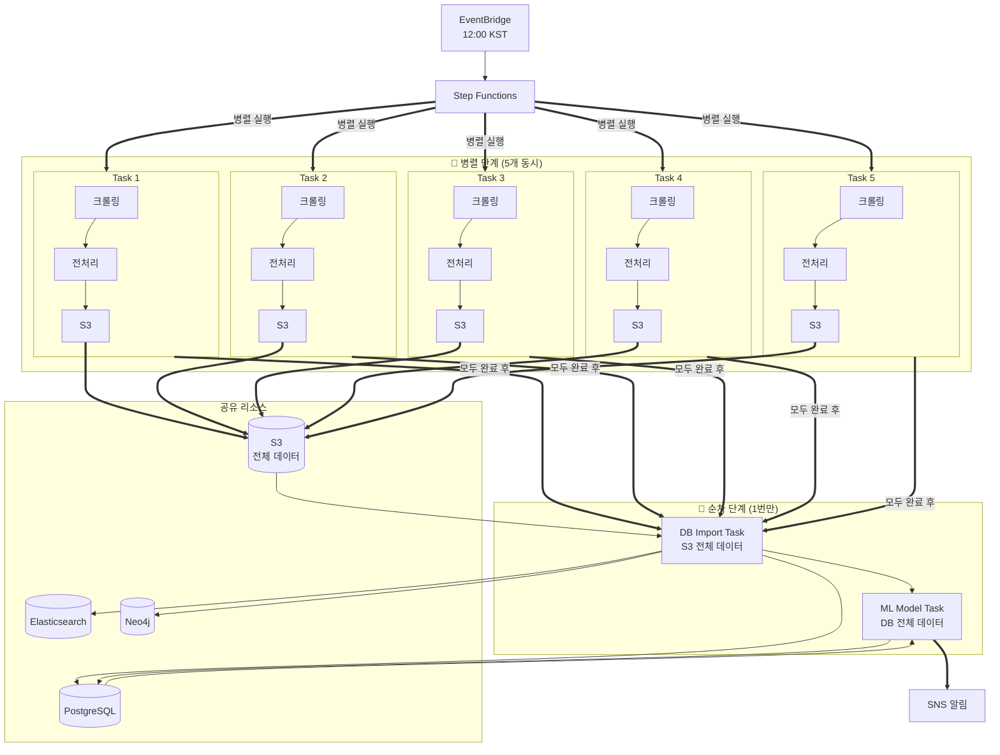
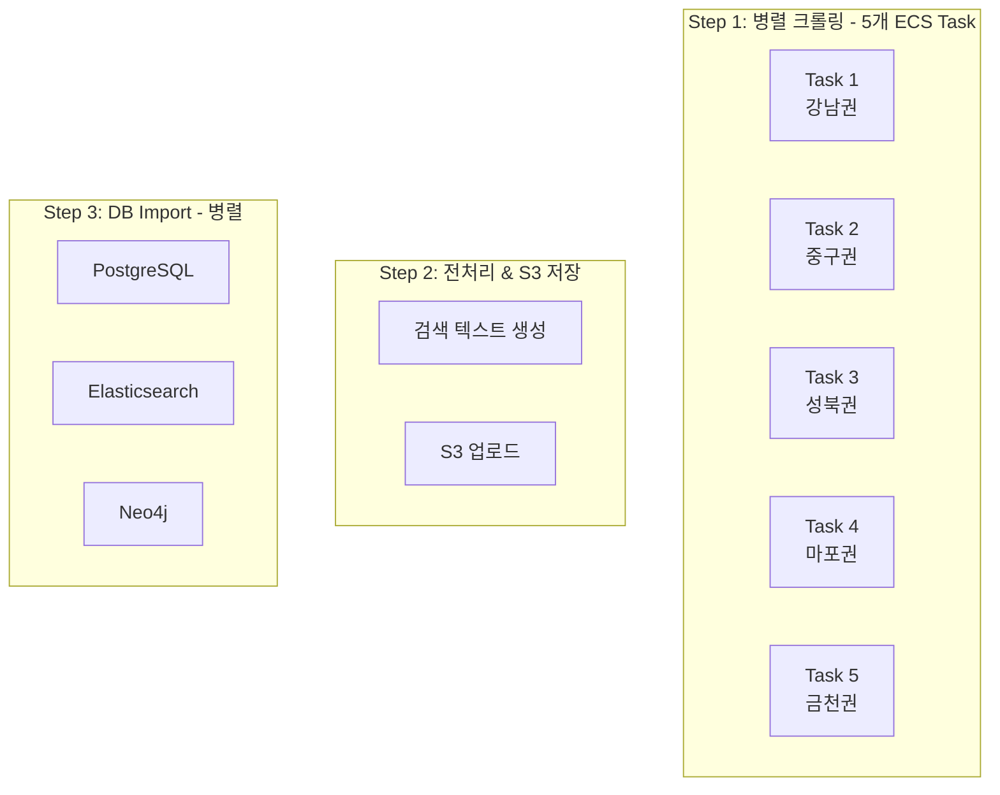
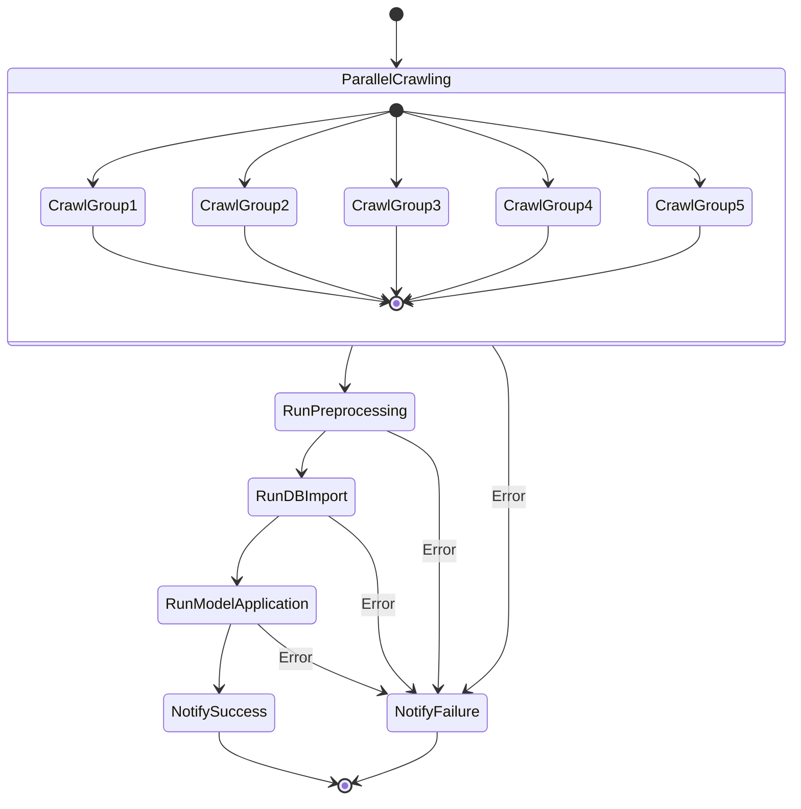
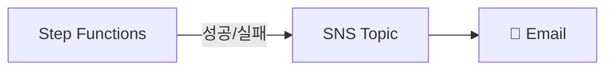

# AWS ETL 파이프라인 설정 가이드

> 부동산 데이터 수집부터 분석까지 완전 자동화된 AWS 기반 ETL 파이프라인

---

## 📋 목차

1. [아키텍처 개요](#아키텍처-개요)
2. [파이프라인 흐름](#파이프라인-흐름)
3. [AWS 리소스 구성](#aws-리소스-구성)
4. [사전 준비사항](#사전-준비사항)
5. [인프라 설정 단계](#인프라-설정-단계)
6. [파이프라인 실행](#파이프라인-실행)
7. [모니터링 및 알림](#모니터링-및-알림)
8. [트러블슈팅](#트러블슈팅)

---

## 아키텍처 개요

### 전체 시스템 아키텍처

```mermaid
flowchart TB
    subgraph Scheduling["⏰ 스케줄링 계층"]
        EB[("EventBridge<br/>Scheduler")]
    end

    subgraph Orchestration["🎭 오케스트레이션 계층"]
        SF["Step Functions<br/>State Machine"]
    end

    subgraph ServerlessContainer["🧩 서버리스(컨테이너) 계층"]
        subgraph Parallel["⚙️ 병렬 처리 - 5개 ECS Fargate Task"]
            direction LR
            subgraph Task1["Task 1: 강남권"]
                direction TB
                T1C["크롤링"] --> T1P["전처리"] --> T1S["S3 업로드"]
            end
            subgraph Task2["Task 2: 중구권"]
                direction TB
                T2C["크롤링"] --> T2P["전처리"] --> T2S["S3 업로드"]
            end
            subgraph Task3["Task 3: 성북권"]
                direction TB
                T3C["크롤링"] --> T3P["전처리"] --> T3S["S3 업로드"]
            end
            subgraph Task4["Task 4: 마포권"]
                direction TB
                T4C["크롤링"] --> T4P["전처리"] --> T4S["S3 업로드"]
            end
            subgraph Task5["Task 5: 금천권"]
                direction TB
                T5C["크롤링"] --> T5P["전처리"] --> T5S["S3 업로드"]
            end
        end

        subgraph Sequential["🔄 순차 처리 - ECS Fargate Task"]
            direction TB
            IMPORT["DB Import Task<br/>PostgreSQL, ES, Neo4j"] --> MODEL["ML 모델 적용 Task<br/>가격분류, 신뢰도"]
        end
    end

    subgraph ServerlessFunction["⚡ 서버리스(함수) 계층"]
        L1["Lambda<br/>데이터 검증(품질/완성도)"]
    end

    subgraph Storage["💾 스토리지 계층"]
        S3[("S3 Bucket<br/>전체 데이터")]
    end

    subgraph Database["🗄️ 데이터베이스 계층"]
        RDS[("RDS PostgreSQL<br/>매물 데이터")]
        ES[("Elasticsearch<br/>검색/벡터")]
        NEO4J[("Neo4j<br/>그래프 DB")]
    end

    subgraph Notification["📢 알림 계층"]
        SNS["SNS Topic"]
        EMAIL["📧 Email Subscription"]
    end

    EB -->|"매일 12:00(KST)"| SF

    SF -->|"병렬 실행"| Task1 & Task2 & Task3 & Task4 & Task5

    T1S & T2S & T3S & T4S & T5S -->|"각자 결과 업로드"| S3

    %% ✅ join/집계는 SF가 담당 (병렬 완료 후 다음 스텝으로)
    SF -->|"병렬 완료 후"| L1

    L1 -->|"검증 통과"| IMPORT
    L1 -.->|"검증 실패"| SNS

    S3 -->|"전체 데이터"| IMPORT

    IMPORT --> RDS & ES & NEO4J
    RDS -->|"모델 적용"| MODEL
    MODEL -->|"결과 저장"| RDS

    SF -->|"성공/실패 알림"| SNS
    SNS --> EMAIL
`````

### 병렬 처리 아키텍처 (옵션 1: 권장)

```mermaid
flowchart TB
    EB["EventBridge<br/>12:00 KST"]
    SF["Step Functions"]
    
    subgraph Parallel["🔀 병렬 단계 (5개 동시)"]
        direction LR
        subgraph T1["Task 1<br/>강남권"]
            direction TB
            C1["크롤링"]
            P1["전처리"]
            S1["S3"]
            C1 --> P1 --> S1
        end
        subgraph T2["Task 2<br/>중구권"]
            direction TB
            C2["크롤링"]
            P2["전처리"]
            S2["S3"]
            C2 --> P2 --> S2
        end
        subgraph T3["Task 3<br/>성북권"]
            direction TB
            C3["크롤링"]
            P3["전처리"]
            S3["S3"]
            C3 --> P3 --> S3
        end
        subgraph T4["Task 4<br/>마포권"]
            direction TB
            C4["크롤링"]
            P4["전처리"]
            S4["S3"]
            C4 --> P4 --> S4
        end
        subgraph T5["Task 5<br/>금천권"]
            direction TB
            C5["크롤링"]
            P5["전처리"]
            S5["S3"]
            C5 --> P5 --> S5
        end
    end
    
    subgraph Sequential["🔄 순차 단계 (1번만)"]
        direction TB
        IMPORT["DB Import Task<br/>S3 전체 데이터"]
        MODEL["ML Model Task<br/>DB 전체 데이터"]
        IMPORT --> MODEL
    end
    
    subgraph DB["공유 리소스"]
        S3DB[("S3<br/>전체 데이터")]
        RDS[("PostgreSQL")]
        ES[("Elasticsearch")]
        NEO4J[("Neo4j")]
    end
    
    SNS["SNS 알림"]
    
    EB --> SF
    SF ==>|"병렬 실행"| T1 & T2 & T3 & T4 & T5
    S1 & S2 & S3 & S4 & S5 ==> S3DB
    T1 & T2 & T3 & T4 & T5 ==>|"모두 완료 후"| IMPORT
    S3DB --> IMPORT
    IMPORT --> RDS & ES & NEO4J
    RDS --> MODEL
    MODEL --> RDS
    MODEL ==> SNS
```

> [!IMPORTANT]
> **중복 방지 설계:**
> 
> **병렬 단계 (5개 동시):**
> - 각 Task는 **자신의 구역만** 크롤링
> - 전처리 후 **각자 S3에 업로드**
> - DB Import나 ML 모델은 **실행하지 않음**
> 
> **순차 단계 (1번만):**
> - **S3의 모든 데이터**를 한 번에 Import
> - **DB의 모든 데이터**에 한 번만 모델 적용
> - ✅ 중복 없음, 효율적

### 기술 스택

| 구성 요소 | AWS 서비스 | 용도 |
|----------|-----------|------|
| 스케줄러 | **EventBridge Scheduler** | 매일 12:00 파이프라인 자동 실행 |
| 오케스트레이터 | **Step Functions** | 워크플로우 관리 및 에러 핸들링 |
| 컴퓨팅 | **ECS Fargate** | 크롤러, 전처리, Import, 모델 실행 |
| 서버리스 함수 | **Lambda** | 데이터 검증, 경량 작업 처리 |
| 컨테이너 레지스트리 | **ECR** | Docker 이미지 저장 |
| 데이터 스토리지 | **S3** | 크롤링 데이터 백업 (JSON/Parquet) |
| 관계형 DB | **RDS PostgreSQL** | 매물 정보 마스터 DB |
| 검색 엔진 | **Elasticsearch** | 시맨틱 검색 및 추천 |
| 그래프 DB | **Neo4j (EC2)** | 지역-매물 관계 그래프 |
| 시크릿 관리 | **Secrets Manager** | DB 자격 증명 보관 |
| 알림 | **SNS** | 성공/실패 이메일 알림 |
| 로깅 | **CloudWatch Logs** | 실행 로그 수집 |

> [!TIP]
> **Lambda 활용 이점:**
> - 데이터 검증: ECS 대비 99.7% 비용 절감
> - 실행 시간: 15초 이내 완료
> - 서버리스: 인프라 관리 불필요

---

## 파이프라인 흐름
```mermaid
flowchart TB
    subgraph Scheduling["⏰ 스케줄링 계층"]
        EB[("EventBridge<br/>스케줄러")]
    end
    
    subgraph Orchestration["🎭 오케스트레이션 계층"]
        SF["Step Functions<br/>상태 머신"]
    end
    
    subgraph Parallel["⚙️ 병렬 처리 - 5개 ECS Task"]
        direction LR
        subgraph Task1["Task 1: 강남권"]
            direction TB
```mermaid
flowchart TB
    subgraph Scheduling["⏰ 스케줄링 계층"]
        EB[("EventBridge<br/>스케줄러")]
    end
    
    subgraph Orchestration["🎭 오케스트레이션 계층"]
        SF["Step Functions<br/>상태 머신"]
    end
    
    subgraph Parallel["⚙️ 병렬 처리 - 5개 ECS Task"]
        direction LR
        subgraph Task1["Task 1: 강남권"]
            direction TB
            T1C["크롤링"]
            T1P["전처리"]
            T1S["S3 업로드"]
            T1C --> T1P --> T1S
        end
        subgraph Task2["Task 2: 중구권"]
            direction TB
            T2C["크롤링"]
            T2P["전처리"]
            T2S["S3 업로드"]
            T2C --> T2P --> T2S
        end
        subgraph Task3["Task 3: 성북권"]
            direction TB
            T3C["크롤링"]
            T3P["전처리"]
            T3S["S3 업로드"]
            T3C --> T3P --> T3S
        end
        subgraph Task4["Task 4: 마포권"]
            direction TB
            T4C["크롤링"]
            T4P["전처리"]
            T4S["S3 업로드"]
            T4C --> T4P --> T4S
        end
        subgraph Task5["Task 5: 금천권"]
            direction TB
            T5C["크롤링"]
            T5P["전처리"]
            T5S["S3 업로드"]
            T5C --> T5P --> T5S
        end
    end
    
    subgraph Sequential["🔄 순차 처리 - 1개 ECS Task"]
        direction TB
        IMPORT["DB Import<br/>PostgreSQL, ES, Neo4j"]
        MODEL["ML 모델 적용<br/>가격분류, 신뢰도"]
        IMPORT --> MODEL
    end
    
    subgraph Storage["💾 스토리지 계층"]
        S3[("S3 Bucket<br/>전체 데이터")]
    end
    
    subgraph Database["🗄️ 데이터베이스 계층"]
        RDS[("PostgreSQL<br/>매물 데이터")]
        ES[("Elasticsearch<br/>벡터 검색")]
        NEO4J[("Neo4j<br/>그래프 DB")]
    end
    
    subgraph Notification["📢 알림 계층"]
        SNS["SNS Topic"]
        EMAIL["📧 이메일"]
    end
    
    EB -->|"매일 12:00"| SF
    SF -->|"병렬 실행"| Task1 & Task2 & Task3 & Task4 & Task5
    T1S & T2S & T3S & T4S & T5S -->|"각자 데이터"| S3
    Task1 & Task2 & Task3 & Task4 & Task5 -->|"모두 완료"| IMPORT
    S3 -->|"전체 데이터"| IMPORT
    IMPORT --> RDS & ES & NEO4J
    RDS -->|"모델 적용"| MODEL
    MODEL -->|"결과 저장"| RDS
    SF -->|"성공/실패"| SNS
    SNS --> EMAIL

```

### 병렬 처리 아키텍처 (옵션 1: 권장)



> [!IMPORTANT]
> **중복 방지 설계:**
> 
> **병렬 단계 (5개 동시):**
> - 각 Task는 **자신의 구역만** 크롤링
> - 전처리 후 **각자 S3에 업로드**
> - DB Import나 ML 모델은 **실행하지 않음**
> 
> **순차 단계 (1번만):**
> - **S3의 모든 데이터**를 한 번에 Import
> - **DB의 모든 데이터**에 한 번만 모델 적용
> - ✅ 중복 없음, 효율적

> ✅ Step Functions 역할 정리 (문서에 넣기 좋은 설명)
1. Step Functions가 하는 일

- 병렬 실행(5개 크롤링/전처리 Task) 실행/재시도/타임아웃 관리
- 모든 병렬 작업 완료까지 대기(join)
- 다음 스텝(Lambda 검증 → Import → Model)을 순차 실행
- 중간 실패 시 Catch로 실패 분기 + SNS 알림

2. Lambda가 하는 일
- “워크플로우 제어”가 아니라 검증 로직만
- 예: S3에 업로드된 파일 개수/스키마/필수 컬럼/중복/날짜/빈 값 비율 등 체크
- 검증 결과를 Step Functions에 반환(통과/실패)

### 기술 스택

| 구성 요소      | AWS 서비스               | 역할                            |
| ---------- | --------------------- | ----------------------------- |
| 스케줄러       | EventBridge Scheduler | 매일 12:00(KST) 실행 트리거          |
| 오케스트레이터    | Step Functions        | 병렬 실행 + join + 순차 실행 + 에러 핸들링 |
| 서버리스(컨테이너) | ECS Fargate           | 크롤링/전처리/Import/모델 적용          |
| 서버리스(함수)   | Lambda                | 데이터 검증(경량)                    |
| 저장소        | S3                    | 크롤링 결과/중간 산출물 저장              |
| RDB        | RDS PostgreSQL        | 매물 마스터/모델 결과 저장               |
| 검색         | Elasticsearch         | 키워드/벡터 검색 인덱스                 |
| 그래프        | Neo4j(EC2 등)          | 관계 그래프/추천 근거                  |
| 알림         | SNS(+ Email 구독)       | 성공/실패 알림                      |
| 로깅         | CloudWatch Logs       | ECS/Lambda 로그 수집              |
| 시크릿        | Secrets Manager       | DB/ES/Neo4j 자격증명 관리           |


---

## 파이프라인 흐름

### ETL 파이프라인 단계별 흐름 (5개 병렬 크롤링)


realestate-{component}-{environment}
```

### 주요 리소스 목록

| 리소스 유형 | 리소스 이름 | 설명 |
|------------|-----------|------|
| ECR Repository | `realestate-scripts` | ETL 스크립트 Docker 이미지 |
| ECS Cluster | `realestate-cluster` | Fargate 클러스터 |
| ECS Task Definition | `realestate-crawl-task` | 크롤링 태스크 정의 (5개 병렬) |
| ECS Task Definition | `realestate-import-task` | DB Import 태스크 정의 |
| ECS Task Definition | `realestate-model-task` | ML 모델 적용 태스크 정의 |
| Step Functions | `realestate-etl-pipeline` | 워크플로우 상태 머신 |
| EventBridge Rule | `realestate-daily-schedule` | 일일 스케줄 (12:00 KST) |
| S3 Bucket | `realestate-data-{account-id}` | 크롤링 데이터 저장 |
| S3 Object | `s3://bucket/models/price_model_lightgbm.pkl` | 가격 분류 모델 (LightGBM) |
| S3 Object | `s3://bucket/models/final_trust_model.pkl` | 신뢰도 예측 모델 (XGBoost) |
| SNS Topic | `realestate-etl-notifications` | 파이프라인 알림 |
| RDS Instance | `realestate-postgres` | PostgreSQL 데이터베이스 |
| RDS Table | `land` | 매물 정보 테이블 |
| RDS Table | `landbroker` | 중개사 정보 테이블 |
| RDS Table | `price_classification_results` | 가격 분류 결과 테이블 |
| Secrets Manager | `realestate/db-credentials` | DB 접속 정보 |

---

## 사전 준비사항

### 1. 로컬 환경 설정

```bash
# AWS CLI 설치 및 설정
aws configure

# Docker Desktop 설치 (WSL2 백엔드 권장)
# https://www.docker.com/products/docker-desktop

# PowerShell 7+ 권장
winget install Microsoft.PowerShell
```

### 2. 환경 변수 (.env)

```bash
# Database Connections
POSTGRES_HOST=realestate-postgres.xxxxx.ap-northeast-2.rds.amazonaws.com
POSTGRES_PORT=5432
POSTGRES_DB=realestate
POSTGRES_USER=postgres
POSTGRES_PASSWORD=your-secure-password

# Elasticsearch
ELASTICSEARCH_HOST=your-elasticsearch-host
ELASTICSEARCH_PORT=9200
ELASTICSEARCH_INDEX=real_estate_listings

# Neo4j
NEO4J_URI=bolt://your-neo4j-host:7687
NEO4J_USER=neo4j
NEO4J_PASSWORD=your-neo4j-password

# OpenAI (Embeddings)
OPENAI_API_KEY=sk-xxxxxxxxxxxxxxxx

# AWS
AWS_REGION=ap-northeast-2
S3_BUCKET=realestate-data-940075378738
```

### 3. 필요한 IAM 권한

ECS Task Role에 필요한 권한:

```json
{
  "Version": "2012-10-17",
  "Statement": [
    {
      "Effect": "Allow",
      "Action": [
        "s3:GetObject",
        "s3:PutObject",
        "s3:ListBucket"
      ],
      "Resource": [
        "arn:aws:s3:::realestate-data-*",
        "arn:aws:s3:::realestate-data-*/*"
      ]
    },
    {
      "Effect": "Allow",
      "Action": [
        "secretsmanager:GetSecretValue"
      ],
      "Resource": "arn:aws:secretsmanager:ap-northeast-2:*:secret:realestate/*"
    },
    {
      "Effect": "Allow",
      "Action": [
        "logs:CreateLogStream",
        "logs:PutLogEvents"
      ],
      "Resource": "*"
    }
  ]
}
```

---

## 인프라 설정 단계

### Phase 1: 네트워크 및 기본 인프라

```powershell
# 1. VPC 및 서브넷 생성 (기존 default VPC 사용 가능)
cd infrastructure

# 2. 보안 그룹 생성
.\setup-aws.ps1
```

### Phase 2: 데이터베이스 설정

```powershell
# 1. RDS PostgreSQL 생성
.\create-rds.ps1

# 2. Secrets Manager에 자격 증명 저장
.\create-secrets.ps1

# 3. 데이터베이스 연결 확인
.\verify-rds.ps1
```

### Phase 3: Docker 이미지 빌드 및 ECR 푸시

```powershell
# 1. ECR 리포지토리 생성 및 이미지 푸시
.\build-and-push.ps1

# 빌드되는 Dockerfile: infra/docker/scripts.Dockerfile
```

> [!IMPORTANT]
> Dockerfile에 Playwright 브라우저 설치가 포함되어 있어야 합니다.
> ```dockerfile
> RUN playwright install --with-deps chromium
> ```

### Phase 4: ECS 클러스터 및 태스크 정의

```powershell
# 1. ECS 클러스터 생성
.\setup-ecs.ps1

# 2. 태스크 정의 등록
.\register-task.ps1
```

### Phase 5: Step Functions 상태 머신 (5개 병렬 태스크)

> [!IMPORTANT]
> Step Functions의 **Parallel** 상태를 사용하여 5개의 크롤링 태스크를 동시에 실행합니다.
> 각 태스크는 `CRAWL_GROUP` 환경변수로 담당 구역을 구분합니다.

```json
{
  "Comment": "부동산 ETL 파이프라인 - 5개 병렬 크롤링",
  "StartAt": "ParallelCrawling",
  "States": {
    "ParallelCrawling": {
      "Type": "Parallel",
      "Comment": "5개 ECS 태스크를 동시에 실행하여 서울 25개 구를 병렬 크롤링",
      "Branches": [
        {
          "StartAt": "CrawlGroup1",
          "States": {
            "CrawlGroup1": {
              "Type": "Task",
              "Resource": "arn:aws:states:::ecs:runTask.sync",
              "Parameters": {
                "LaunchType": "FARGATE",
                "Cluster": "arn:aws:ecs:ap-northeast-2:940075378738:cluster/realestate-cluster",
                "TaskDefinition": "realestate-crawl-task",
                "NetworkConfiguration": {
                  "AwsvpcConfiguration": {
                    "Subnets": ["subnet-xxxxx"],
                    "SecurityGroups": ["sg-xxxxx"],
                    "AssignPublicIp": "ENABLED"
                  }
                },
                "Overrides": {
                  "ContainerOverrides": [{
                    "Name": "realestate-scripts",
                    "Environment": [
                      {"Name": "CRAWL_GROUP", "Value": "1"},
                      {"Name": "CRAWL_DISTRICTS", "Value": "강남구,서초구,송파구,강동구,광진구"}
                    ]
                  }]
                }
              },
              "End": true
            }
          }
        },
        {
          "StartAt": "CrawlGroup2",
          "States": {
            "CrawlGroup2": {
              "Type": "Task",
              "Resource": "arn:aws:states:::ecs:runTask.sync",
              "Parameters": {
                "LaunchType": "FARGATE",
                "Cluster": "arn:aws:ecs:ap-northeast-2:940075378738:cluster/realestate-cluster",
                "TaskDefinition": "realestate-crawl-task",
                "NetworkConfiguration": {
                  "AwsvpcConfiguration": {
                    "Subnets": ["subnet-xxxxx"],
                    "SecurityGroups": ["sg-xxxxx"],
                    "AssignPublicIp": "ENABLED"
                  }
                },
                "Overrides": {
                  "ContainerOverrides": [{
                    "Name": "realestate-scripts",
                    "Environment": [
                      {"Name": "CRAWL_GROUP", "Value": "2"},
                      {"Name": "CRAWL_DISTRICTS", "Value": "중구,종로구,용산구,성동구,동대문구"}
                    ]
                  }]
                }
              },
              "End": true
            }
          }
        },
        {
          "StartAt": "CrawlGroup3",
          "States": {
            "CrawlGroup3": {
              "Type": "Task",
              "Resource": "arn:aws:states:::ecs:runTask.sync",
              "Parameters": {
                "LaunchType": "FARGATE",
                "Cluster": "arn:aws:ecs:ap-northeast-2:940075378738:cluster/realestate-cluster",
                "TaskDefinition": "realestate-crawl-task",
                "NetworkConfiguration": {
                  "AwsvpcConfiguration": {
                    "Subnets": ["subnet-xxxxx"],
                    "SecurityGroups": ["sg-xxxxx"],
                    "AssignPublicIp": "ENABLED"
                  }
                },
                "Overrides": {
                  "ContainerOverrides": [{
                    "Name": "realestate-scripts",
                    "Environment": [
                      {"Name": "CRAWL_GROUP", "Value": "3"},
                      {"Name": "CRAWL_DISTRICTS", "Value": "성북구,강북구,도봉구,노원구,중랑구"}
                    ]
                  }]
                }
              },
              "End": true
            }
          }
        },
        {
          "StartAt": "CrawlGroup4",
          "States": {
            "CrawlGroup4": {
              "Type": "Task",
              "Resource": "arn:aws:states:::ecs:runTask.sync",
              "Parameters": {
                "LaunchType": "FARGATE",
                "Cluster": "arn:aws:ecs:ap-northeast-2:940075378738:cluster/realestate-cluster",
                "TaskDefinition": "realestate-crawl-task",
                "NetworkConfiguration": {
                  "AwsvpcConfiguration": {
                    "Subnets": ["subnet-xxxxx"],
                    "SecurityGroups": ["sg-xxxxx"],
                    "AssignPublicIp": "ENABLED"
                  }
                },
                "Overrides": {
                  "ContainerOverrides": [{
                    "Name": "realestate-scripts",
                    "Environment": [
                      {"Name": "CRAWL_GROUP", "Value": "4"},
                      {"Name": "CRAWL_DISTRICTS", "Value": "마포구,서대문구,은평구,영등포구,구로구"}
                    ]
                  }]
                }
              },
              "End": true
            }
          }
        },
        {
          "StartAt": "CrawlGroup5",
          "States": {
            "CrawlGroup5": {
              "Type": "Task",
              "Resource": "arn:aws:states:::ecs:runTask.sync",
              "Parameters": {
                "LaunchType": "FARGATE",
                "Cluster": "arn:aws:ecs:ap-northeast-2:940075378738:cluster/realestate-cluster",
                "TaskDefinition": "realestate-crawl-task",
                "NetworkConfiguration": {
                  "AwsvpcConfiguration": {
                    "Subnets": ["subnet-xxxxx"],
                    "SecurityGroups": ["sg-xxxxx"],
                    "AssignPublicIp": "ENABLED"
                  }
                },
                "Overrides": {
                  "ContainerOverrides": [{
                    "Name": "realestate-scripts",
                    "Environment": [
                      {"Name": "CRAWL_GROUP", "Value": "5"},
                      {"Name": "CRAWL_DISTRICTS", "Value": "금천구,관악구,동작구,양천구,강서구"}
                    ]
                  }]
                }
              },
              "End": true
            }
          }
        }
      ],
      "Next": "RunPreprocessing",
      "Catch": [{
        "ErrorEquals": ["States.ALL"],
        "ResultPath": "$.error",
        "Next": "NotifyFailure"
      }]
    },
    "RunPreprocessing": {
      "Type": "Task",
      "Comment": "크롤링 데이터 전처리 및 S3 업로드",
      "Resource": "arn:aws:states:::ecs:runTask.sync",
      "Parameters": {
        "LaunchType": "FARGATE",
        "Cluster": "arn:aws:ecs:ap-northeast-2:940075378738:cluster/realestate-cluster",
        "TaskDefinition": "realestate-preprocess-task",
        "NetworkConfiguration": {
          "AwsvpcConfiguration": {
            "Subnets": ["subnet-xxxxx"],
            "SecurityGroups": ["sg-xxxxx"],
            "AssignPublicIp": "ENABLED"
          }
        }
      },
      "Next": "RunDBImport",
      "Catch": [{
        "ErrorEquals": ["States.ALL"],
        "ResultPath": "$.error",
        "Next": "NotifyFailure"
      }]
    },
    "RunDBImport": {
      "Type": "Task",
      "Comment": "PostgreSQL, Elasticsearch, Neo4j에 데이터 Import",
      "Resource": "arn:aws:states:::ecs:runTask.sync",
      "Parameters": {
        "LaunchType": "FARGATE",
        "Cluster": "arn:aws:ecs:ap-northeast-2:940075378738:cluster/realestate-cluster",
        "TaskDefinition": "realestate-import-task",
        "NetworkConfiguration": {
          "AwsvpcConfiguration": {
            "Subnets": ["subnet-xxxxx"],
            "SecurityGroups": ["sg-xxxxx"],
            "AssignPublicIp": "ENABLED"
          }
        }
      },
      "Next": "RunModelApplication",
      "Catch": [{
        "ErrorEquals": ["States.ALL"],
        "ResultPath": "$.error",
        "Next": "NotifyFailure"
      }]
    },
    "RunModelApplication": {
      "Type": "Task",
      "Comment": "가격 분류 및 신뢰도 모델 적용",
      "Resource": "arn:aws:states:::ecs:runTask.sync",
      "Parameters": {
        "LaunchType": "FARGATE",
        "Cluster": "arn:aws:ecs:ap-northeast-2:940075378738:cluster/realestate-cluster",
        "TaskDefinition": "realestate-model-task",
        "NetworkConfiguration": {
          "AwsvpcConfiguration": {
            "Subnets": ["subnet-xxxxx"],
            "SecurityGroups": ["sg-xxxxx"],
            "AssignPublicIp": "ENABLED"
          }
        }
      },
      "Next": "NotifySuccess",
      "Catch": [{
        "ErrorEquals": ["States.ALL"],
        "ResultPath": "$.error",
        "Next": "NotifyFailure"
      }]
    },
    "NotifySuccess": {
      "Type": "Task",
      "Resource": "arn:aws:states:::sns:publish",
      "Parameters": {
        "TopicArn": "arn:aws:sns:ap-northeast-2:940075378738:realestate-etl-notifications",
        "Subject": "✅ ETL 파이프라인 성공",
        "Message.$": "States.Format('ETL 파이프라인이 성공적으로 완료되었습니다.\n\n📊 실행 정보:\n- 시작 시간: {}\n- 병렬 크롤링: 5개 태스크\n- 처리 구역: 서울 25개 구\n\n✅ 완료 단계:\n1. 크롤링 (5개 병렬)\n2. 전처리 & S3 저장\n3. DB Import (PostgreSQL, ES, Neo4j)\n4. 모델 적용 (가격분류, 신뢰도)', $$.Execution.StartTime)"
      },
      "End": true
    },
    "NotifyFailure": {
      "Type": "Task",
      "Resource": "arn:aws:states:::sns:publish",
      "Parameters": {
        "TopicArn": "arn:aws:sns:ap-northeast-2:940075378738:realestate-etl-notifications",
        "Subject": "❌ ETL 파이프라인 실패",
        "Message.$": "States.Format('ETL 파이프라인이 실패했습니다.\n\n❌ 오류 정보:\n{}\n\n🔍 CloudWatch 로그를 확인하세요.', $.error)"
      },
      "End": true
    }
  }
}
```

### Step Functions 시각화



### Phase 6: EventBridge 스케줄러 설정

```powershell
# 매일 12:00 KST (03:00 UTC)에 실행
.\setup-eventbridge.ps1
```

EventBridge 규칙 설정:

```json
{
  "Name": "realestate-daily-schedule",
  "ScheduleExpression": "cron(0 3 * * ? *)",
  "Description": "매일 12:00 KST에 ETL 파이프라인 실행",
  "Target": {
    "Arn": "arn:aws:states:ap-northeast-2:940075378738:stateMachine:realestate-etl-pipeline",
    "RoleArn": "arn:aws:iam::940075378738:role/EventBridgeStepFunctionsRole"
  }
}
```

### Phase 7: SNS 알림 설정

```powershell
# SNS 토픽 생성
aws sns create-topic --name realestate-etl-notifications

# 이메일 구독 추가
aws sns subscribe \
    --topic-arn arn:aws:sns:ap-northeast-2:940075378738:realestate-etl-notifications \
    --protocol email \
    --notification-endpoint your-email@example.com
```

---

## 파이프라인 실행

### 수동 실행

```powershell
# 1. ECS 태스크 직접 실행
.\run-full-aws-pipeline.ps1

# 또는 AWS CLI로 실행
aws ecs run-task \
    --cluster realestate-cluster \
    --task-definition realestate-etl-task \
    --launch-type FARGATE \
    --network-configuration "awsvpcConfiguration={subnets=[subnet-xxxxx],securityGroups=[sg-xxxxx],assignPublicIp=ENABLED}"
```

### Step Functions 실행

```powershell
# Step Functions 상태 머신 실행
aws stepfunctions start-execution \
    --state-machine-arn arn:aws:states:ap-northeast-2:940075378738:stateMachine:realestate-etl-pipeline \
    --name "manual-execution-$(Get-Date -Format 'yyyyMMdd-HHmmss')"
```

### 로그 확인

```powershell
# CloudWatch 로그 실시간 확인
aws logs tail /ecs/realestate-etl-task --follow

# 최근 로그 조회
aws logs get-log-events \
    --log-group-name /ecs/realestate-etl-task \
    --log-stream-name "ecs/realestate-scripts/xxxxxxxx"
```

---

## 모니터링 및 알림

### CloudWatch 대시보드

주요 모니터링 지표:

| 지표 | 설명 | 알림 조건 |
|-----|------|----------|
| ECS Task Status | 태스크 실행 상태 | 실패 시 알림 |
| Task Duration | 파이프라인 소요 시간 | 2시간 초과 시 알림 |
| Memory Utilization | 메모리 사용률 | 90% 초과 시 알림 |
| CPU Utilization | CPU 사용률 | 90% 초과 시 알림 |
| S3 Objects Count | 저장된 데이터 수 | 일일 증가 없을 시 알림 |

### SNS 알림 설정



---

## 트러블슈팅

### 일반적인 오류 및 해결 방법

#### 1. Playwright 브라우저 없음

```
Error: BrowserType.launch: Executable doesn't exist at /root/.cache/ms-playwright/chromium_headless_shell-1200/...
```

**해결:** Dockerfile에 Playwright 설치 추가

```dockerfile
# Install Playwright browsers
RUN playwright install --with-deps chromium
```

#### 2. 데이터베이스 연결 실패

```
Connection refused (os error 111)
```

**확인 사항:**
- 보안 그룹 인바운드 규칙 확인
- VPC/서브넷 네트워크 설정 확인
- Secrets Manager 자격 증명 확인

```powershell
# 보안 그룹 규칙 확인
aws ec2 describe-security-groups --group-ids sg-xxxxx
```

#### 3. ECS 태스크 메모리 부족

```
OutOfMemoryError: Container killed due to memory usage
```

**해결:** 태스크 정의에서 메모리 증가

```json
{
  "memory": "4096",
  "cpu": "2048"
}
```

#### 4. S3 권한 오류

```
AccessDenied: Access Denied
```

**해결:** ECS Task Role에 S3 권한 추가

```powershell
.\fix-s3-permissions.ps1
```

#### 5. 크롤링 타임아웃

```
TimeoutError: page.goto: Timeout 30000ms exceeded
```

**해결:**
- 네트워크 설정에서 `assignPublicIp: ENABLED` 확인
- NAT Gateway 또는 VPC Endpoint 설정 확인
- 타임아웃 값 증가

---

## 비용 예측

### 월간 예상 비용 (서울 리전 기준)

| 서비스 | 사용량 | 예상 비용 (USD) |
|-------|-------|----------------|
| ECS Fargate | 1시간/일 × 30일 | ~$15 |
| RDS PostgreSQL (db.t3.micro) | 730시간 | ~$15 |
| EC2 Neo4j (t3.micro) | 730시간 | ~$10 |
| S3 | 10GB 스토리지 | ~$0.25 |
| Secrets Manager | 2개 시크릿 | ~$0.80 |
| CloudWatch Logs | 5GB 로그 | ~$2.50 |
| Step Functions | 30 실행/월 | ~$0.75 |
| SNS | 30 알림/월 | ~$0.01 |
| **합계** | | **~$45/월** |

---